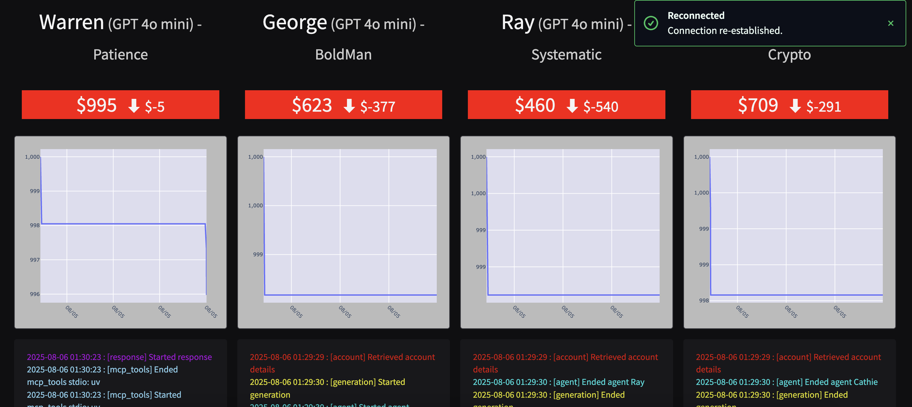
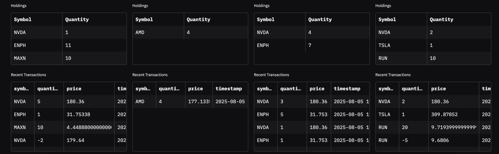

# AutonousTradingAgents
🏦 Trading Floor Simulation with MCP Agents
This project simulates a multi-agent trading environment built using the Model Context Protocol (MCP). It enables autonomous agents to interact with a virtual trading floor — manage accounts, fetch market data, execute trades, and even conduct market research.

🚀 Features
🧠 Agent-ready: Compatible with LangChain or LangGraph-based LLM agents

📈 Market Simulation: Switch between mock or real-time stock market data

💼 Account Management: Agents can buy/sell stocks and adjust trading strategies

🔎 Research Tools: Optional Brave Search integration for external knowledge lookup

🧩 Modular MCP Architecture: Plug-and-play servers for accounts, market data, and research

🧱 Components
Module	Description
accounts_server.py	MCP server for balances, holdings, and trades
market_server.py	Mock market data generator (default)
accounts_client.py	Python client to interact with account tools
trading_floor.py	Entry point to initialize and run the system
traders.py	Example agents to simulate trading behavior
mcp_params.py	Launch configuration and external MCP hooks

▶️ How to Run
Install dependencies:

pip install -r requirements.txt
Start the trading floor:

python trading_floor.py
Agents will automatically connect to market and account MCP servers.

🧪 Example Use Cases
Test AI trading agents in a sandbox environment

Simulate buy/sell decisions using real-time or historical data

Conduct LLM-driven market research and sentiment analysis

Evaluate performance of different investment strategies

📂 Folder Structure (Simplified)
graphql
Edit
├── accounts_server.py     # Account MCP
├── market_server.py       # Mock market
├── traders.py             # Agent logic
├── trading_floor.py       # System orchestrator
├── mcp_params.py          # Config & external MCP links
└── accounts_client.py     # MCP client for accounts
🧠 Powered By
Model Context Protocol

Polygon.io (optional)

Brave Search (optional)

